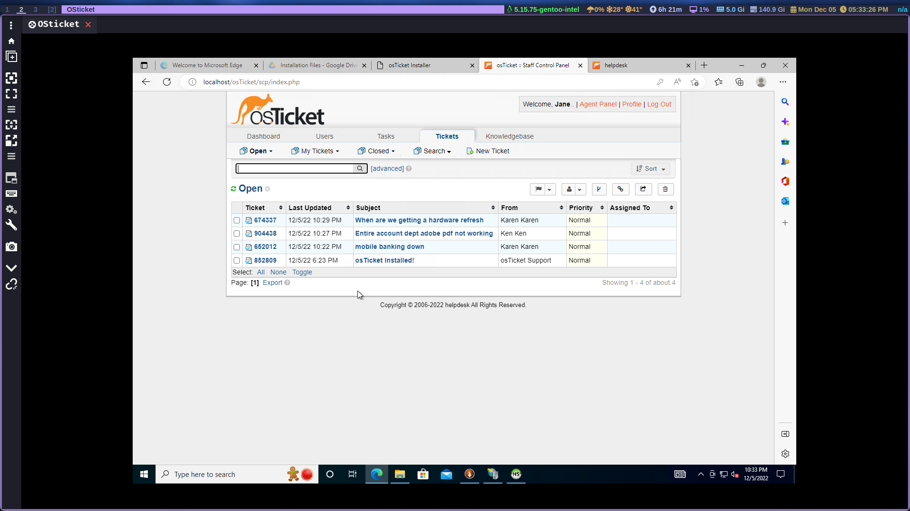
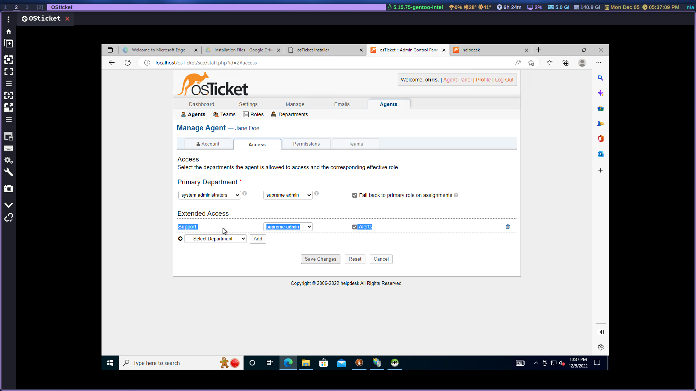
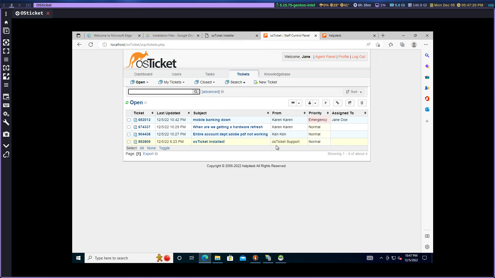
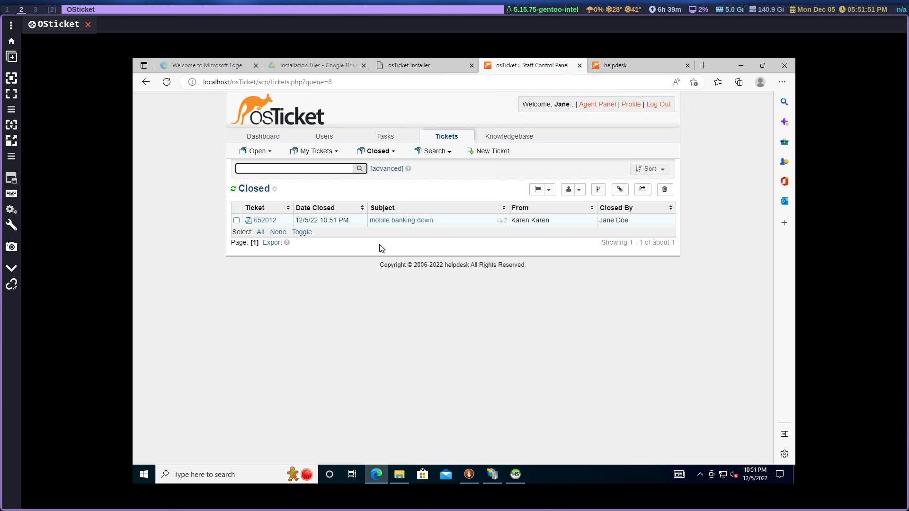

# osTicket - Ticket Lifecycle: Intake Through Resolution
This tutorial outlines the lifecycle of a ticket from intake to resolution within the open-source help desk ticketing system osTicket.

## Environments and Technologies Used

- Microsoft Azure (Virtual Machines/Compute)
- Remote Desktop
- Internet Information Services (IIS)

## Operating Systems Used 

- Windows 10 (21H2)

## Ticket Lifecycle Stages

- Intake
- Assignment and Communication
- Working the Issue
- Resolution

Now that we [installed](https://github.com/cmpi66/osticket-prereqs) and [configured](https://github.com/cmpi66/post-install-config) osTicket, let's create some tickets and practice tagging and solving them.

<!-- ## Lifecycle Stages -->

## Create Tickets 

Create a ticket as Karen under the help topic "Business critical outage". Let's say the mobile banking system went down and customers can't make any orders. 

Now create another ticket as Ken, under the topic of "personal computer"; maybe accounting is having problems with adobe since it last updated. 

Create another ticket as Karen under "general inquiry", she wants to know when new equipment is coming in her team's laptops are slow.

- now login as one of the agents you previously created, make sure they have access to the support department or else they won't  be able to see the tickets.

## Organize Tickets

The tickets are all at the same priority level, let's organize them. Obviously the mobile banking ticket we created earlier is high priority. So we set it at "emergency" level and then we change the SLA to SEV-A, finally we assign the ticket to Jane Doe.

## Solve the tickets

Now we can pretend to solve the tickets and by writing updates within each ticket and keeping track of the steps we took. I just "solved" one ticket, I'll leave the rest to you. Be creative in how you solve and update them, make them as realistic as possible.

Hopefully you enjoyed this three-part osTicket tutorial. Now  you have some familiarity with osTicket and you can use it to train your team.
